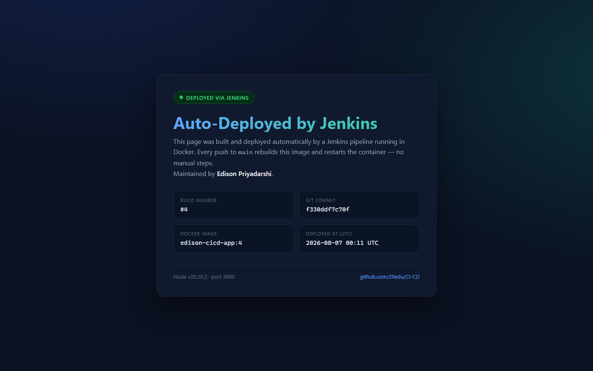
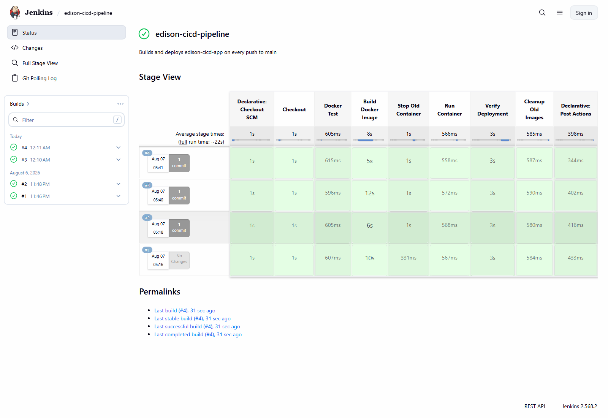
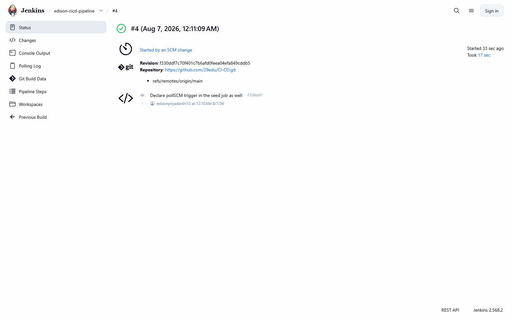
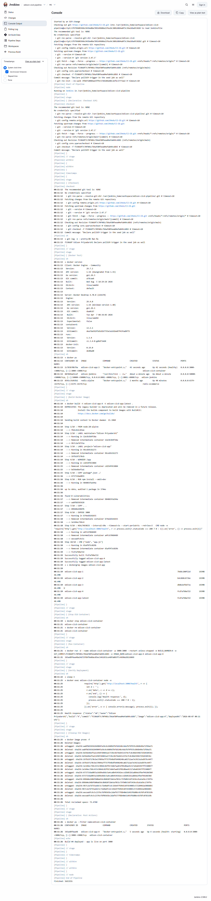

# CI/CD Pipeline with Jenkins + Docker

**GitHub Repository:** https://github.com/29edu/CI-CD

A Node.js web app that is built and deployed **automatically** by a Jenkins pipeline
running inside a Docker container. Push to `main`, and within a minute Jenkins picks
up the change, rebuilds the image, replaces the running container, and verifies the
new deployment is healthy.

**Author:** Edison Priyadarshi

---

## Naming

Every resource is namespaced with the author's name, as required by the assignment:

| Resource | Name |
| --- | --- |
| Docker image | `edison-cicd-app` (tagged `:latest` and `:<build-number>`) |
| App container | `edison-cicd-container` |
| Jenkins container | `edison-jenkins` |
| EC2 instance | `edison-jenkins-server` |

---

## Architecture

```
   git push
      |
      v
  GitHub  (github.com/29edu/CI-CD)
      |
      |  pollSCM  * * * * *   (checks every minute)
      v
  Jenkins container  "edison-jenkins"  :8080
      |  mounts /var/run/docker.sock  ->  builds on the host daemon
      v
  Docker image  "edison-cicd-app:<build>"
      |
      v
  App container  "edison-cicd-container"  :3000
```

Jenkins runs the Docker CLI against the **host** Docker daemon via a mounted
socket, so the image it builds and the container it starts are siblings of the
Jenkins container, not nested inside it.

---

## Pipeline stages

Defined in [`Jenkinsfile`](Jenkinsfile):

| # | Stage | What it does |
| --- | --- | --- |
| 1 | **Checkout** | Pulls the latest commit from GitHub and prints it |
| 2 | **Docker Test** | Confirms the agent can reach the Docker daemon |
| 3 | **Build Docker Image** | Builds `edison-cicd-app:$BUILD_NUMBER` and `:latest` |
| 4 | **Stop Old Container** | Stops and removes the previous container |
| 5 | **Run Container** | Starts the new container on port 3000, injecting build metadata |
| 6 | **Verify Deployment** | Calls `/health` inside the container; fails the build on a bad response |
| 7 | **Cleanup Old Images** | Prunes dangling images so the disk does not fill up |

---

## How auto-deploy works

The pipeline declares:

```groovy
triggers {
    pollSCM('* * * * *')
}
```

Jenkins checks GitHub every minute. When the commit SHA on `main` differs from the
last build, a new build starts on its own — no button press, no manual redeploy.
The build number and commit SHA are passed into the container as environment
variables and rendered on the page, so you can see at a glance which build you are
looking at.

> **Note:** `pollSCM` works from any network, including a laptop behind NAT.
> On a public EC2 instance you can swap it for a GitHub webhook pointed at
> `http://<EC2-PUBLIC-IP>:8080/github-webhook/` for instant (rather than
> up-to-60-second) deploys.

---

## Setup

### Option A — Jenkins on an EC2 instance

1. Launch an Ubuntu EC2 instance named **`edison-jenkins-server`**
   (t2.medium or larger; Jenkins needs ~2 GB RAM).
2. In the security group, open inbound **22** (SSH), **8080** (Jenkins) and
   **3000** (the app).
3. SSH in and install Docker:

```bash
sudo apt update && sudo apt install -y docker.io && sudo usermod -aG docker ubuntu && newgrp docker
```

4. Run Jenkins with the Docker socket and CLI mounted in:

```bash
docker run -d --name edison-jenkins -p 8080:8080 -p 50000:50000 -v jenkins_home:/var/jenkins_home -v /var/run/docker.sock:/var/run/docker.sock -v $(which docker):/usr/bin/docker --group-add $(getent group docker | cut -d: -f3) jenkins/jenkins:lts
```

5. Open `http://<EC2-PUBLIC-IP>:8080` and unlock Jenkins:

```bash
docker exec edison-jenkins cat /var/jenkins_home/secrets/initialAdminPassword
```

6. Install the suggested plugins, then create a **Pipeline** job:
   - **Definition:** Pipeline script from SCM
   - **SCM:** Git
   - **Repository URL:** `https://github.com/29edu/CI-CD.git`
   - **Branch:** `*/main`
   - **Script Path:** `Jenkinsfile`
   - Tick **Poll SCM** (the schedule comes from the `Jenkinsfile`)

7. Click **Build Now** once to seed the job, then let polling take over.
   The app is live at `http://<EC2-PUBLIC-IP>:3000`.

### Option B — Jenkins locally with Docker Desktop (one command)

[`jenkins/`](jenkins) contains a small Jenkins image definition that bakes in the
Docker CLI, the required plugins, and the pipeline job itself via
[Configuration as Code](jenkins/casc.yaml) — so there is no setup wizard, no
plugin picker and no job to create by hand.

```bash
docker build -t edison-jenkins ./jenkins
```

```bash
docker run -d --name edison-jenkins --user root -p 8080:8080 -p 50000:50000 -v jenkins_home:/var/jenkins_home -v //var/run/docker.sock:/var/run/docker.sock edison-jenkins
```

Jenkins comes up at `http://localhost:8080` with the **`edison-cicd-pipeline`**
job already pointing at this repo. Log in as `admin` / `admin123` and press
**Build Now**; after that, polling takes over. The app lands on
`http://localhost:3000`.

> `--user root` is what lets Jenkins reach the mounted Docker socket on Docker
> Desktop. That is fine for a local demo — on EC2 prefer the `--group-add`
> approach from Option A.

---

## Proving auto-deploy

1. Edit the heading in [`app.js`](app.js).
2. Commit and push:

```bash
git add app.js && git commit -m "Change heading" && git push
```

3. Wait up to 60 seconds. Jenkins starts a build by itself.
4. Refresh `http://localhost:3000` — the new text is there and the
   **Build Number** on the page has incremented.

---

## Running without Jenkins

```bash
docker build -t edison-cicd-app . && docker run -d -p 3000:3000 --name edison-cicd-container edison-cicd-app
```

Or straight from Node:

```bash
npm start
```

---

## Endpoints

| Path | Response |
| --- | --- |
| `/` | Status page showing build number, commit, image tag and deploy time |
| `/health` | JSON health check consumed by the pipeline's verify stage and by Docker's `HEALTHCHECK` |

---

## Screenshots

All captured from a real run of this pipeline. Jenkins was reached on port
`8081` here because `8080` was already occupied on the host machine.

### The running app

The deployed page, showing the build number, the commit it was built from and
the exact image tag it is running.



### Pipeline stage view

Four builds, green across all seven stages. Only **#1** was started by hand —
**#2**, **#3** and **#4** each show *1 commit*, meaning polling picked up a
push and ran them on its own.



### Proof of automatic deployment

Build **#4** was **"Started by an SCM change"** — nobody pressed *Build Now*.
A commit was pushed to GitHub, `pollSCM` noticed it within a minute, and the
pipeline rebuilt the image and replaced the running container on its own.



### Build console

Full console output of build #4, ending in `Finished: SUCCESS`.



### Docker state

Raw `docker ps` / `docker images` output is kept as text in
[`screenshots/docker-output.txt`](screenshots/docker-output.txt) so it stays
greppable and verifiable:

```
NAMES                   IMAGE               STATUS
edison-cicd-container   edison-cicd-app:4   Up (healthy)   0.0.0.0:3000->3000/tcp
edison-jenkins          edison-jenkins      Up             0.0.0.0:8081->8080/tcp

edison-cicd-app:4        fcd7a7b8a722   <- currently deployed
edison-cicd-app:latest   fcd7a7b8a722
edison-cicd-app:3        db0e2efbd73a
edison-cicd-app:2        b4c860cb736e
edison-cicd-app:1        7b68c200f22d
```

One image per build, with `:latest` tracking the newest — so any build can be
rolled back to by tag.
